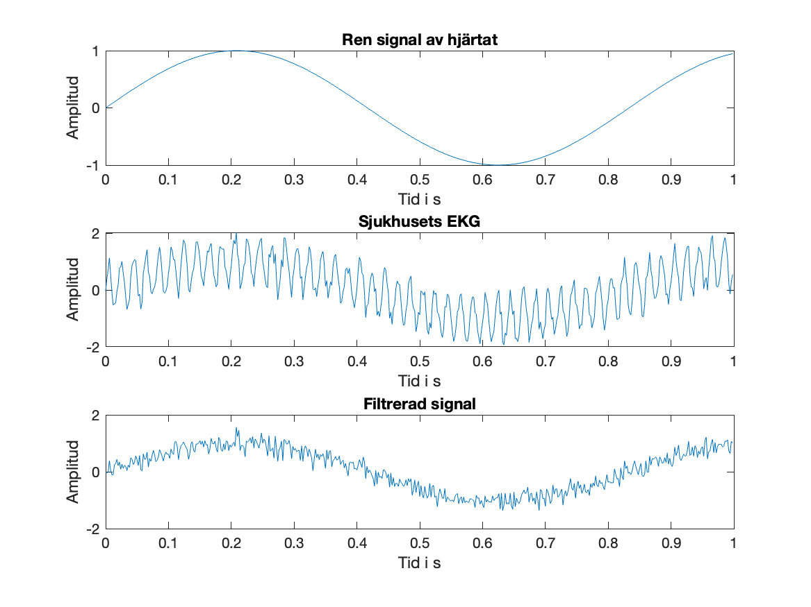
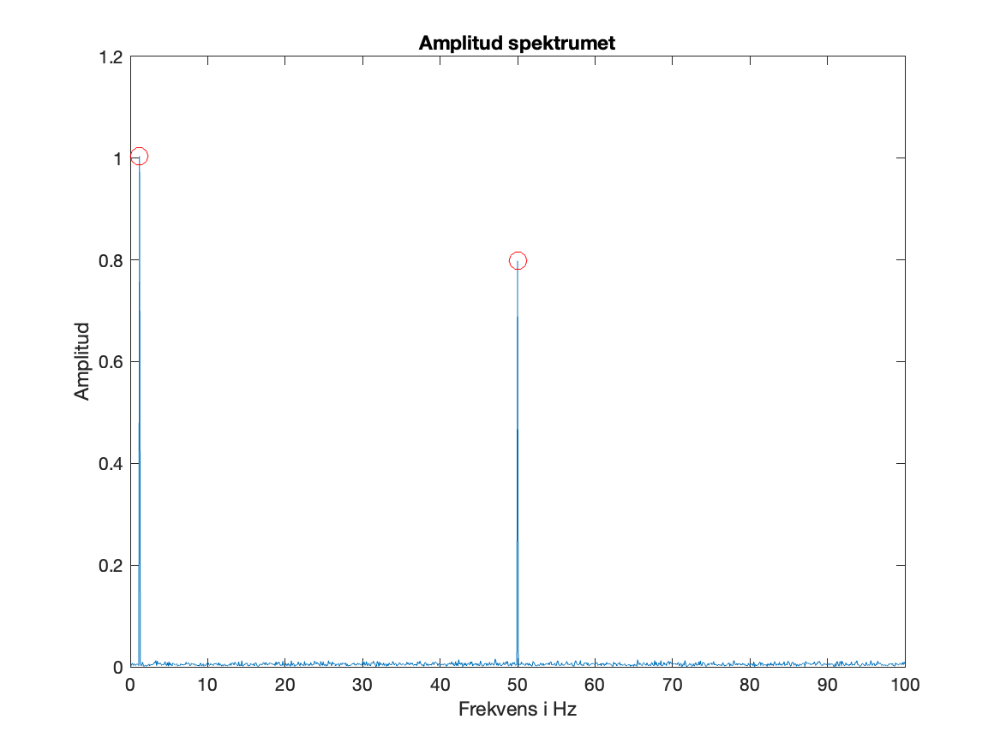
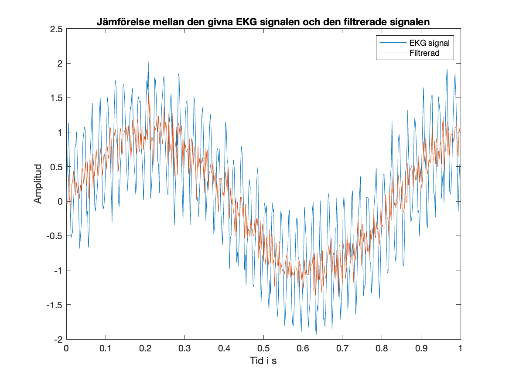

# FFT.m

`FFT.m` simulates an ECG-like signal, adds random noise and a 50 Hz interference component, uses the Fast Fourier Transform (FFT) to detect the dominant heart-rate and disturbance frequencies, removes the disturbance in the frequency domain, reconstructs the filtered signal with the inverse FFT, and visualizes the result.

## Purpose

This script is a compact demonstration of how Fourier analysis can be used in signal processing to study and clean up a measured signal. The example is based on an ECG-like waveform contaminated by two realistic effects: random measurement noise and periodic electrical interference from the power grid. By moving from the time domain to the frequency domain, the script makes it possible to identify which frequencies belong to the useful physiological signal and which belong to the disturbance.

The main idea is that a heart rhythm appears as a low-frequency oscillation, while electrical interference from hospital equipment or surrounding electronics often appears around `50 Hz` in Europe. Since these components are separated in frequency, the FFT gives a natural way to detect and remove the unwanted part without modifying the rest of the signal too much.

## What the script does

The script creates a synthetic heart signal at 1.2 Hz, corresponding to 72 BPM, and combines it with Gaussian noise and a sinusoidal 50 Hz disturbance. It then computes the FFT of the noisy signal, builds an amplitude spectrum, and searches for the dominant peak in the low-frequency range to estimate the heart frequency.

It also searches around 50 Hz to identify the interference peak. After that, the code removes the disturbance by zeroing a narrow band of FFT coefficients around the 50 Hz component and its mirrored negative-frequency component. The filtered time-domain signal is obtained with the inverse FFT.

In other words, the workflow is:

1. construct a clean synthetic heart signal
2. add noise and harmonic disturbance
3. transform the signal using the FFT
4. estimate the dominant frequencies from the spectrum
5. remove the unwanted frequency component
6. reconstruct the cleaned signal with the inverse FFT
7. compare the original and filtered signals visually

## Signal model

The simulated ECG-like signal is built from three parts:

- a sinusoidal heart component
- additive Gaussian noise
- a sinusoidal disturbance at `50 Hz`

The clean heart signal is defined with amplitude `A = 1.0` and frequency `fh = 1.2 Hz`. Since `1.2 * 60 = 72`, this corresponds to a heart rate of `72 BPM`. This signal is not intended to reproduce a medically realistic ECG waveform in full detail, but rather to provide a clean periodic component that can be analyzed clearly in both time and frequency.

The noise term is generated with `randn`, which introduces random fluctuations across the whole signal. This mimics electronic or measurement noise that does not have a single dominant frequency.

The disturbance term uses amplitude `B = 0.8` and frequency `fi = 50 Hz`. That component represents power-line interference, which is one of the most common frequency-domain artifacts in biosignal recordings.

The final measured signal is therefore:

`ekgsignal = hjarta + brus + storning`

## Sampling and resolution

The script uses a sampling frequency of `500 Hz` over a total duration of `10 s`. This gives:

- `N = 5000` total samples
- `dt = 1 / fs = 0.002 s` time step
- `df = fs / N = 0.1 Hz` frequency resolution

This frequency resolution is important because it determines how precisely the script can locate peaks in the spectrum. With `df = 0.1 Hz`, the program can distinguish frequencies in steps of one tenth of a hertz, which is more than enough to identify a heart frequency near `1.2 Hz` and a disturbance near `50 Hz`.

## FFT analysis

After generating the noisy ECG signal, the script computes its discrete Fourier transform with:

`X = fft(ekgsignal)`

The FFT converts the signal from the time domain into the frequency domain. Instead of showing how the signal varies over time, the transformed data shows how much energy or amplitude is present at different frequencies.

The script then computes an amplitude spectrum using:

`amp = 2 * abs(X) / N`

This scaling is chosen so that the amplitudes of sinusoidal components can be interpreted more naturally in the one-sided spectrum. The first term, corresponding to the DC component, is adjusted separately so it is not doubled.

The frequency axis is built from:

`f = n * df`

Only the first half of the spectrum is plotted, because for a real-valued signal the second half is the mirrored negative-frequency part.

## Frequency detection

The script does not simply search the whole spectrum for the largest peak. Instead, it looks in two specific frequency windows:

- indices `6:31` for the heart signal
- indices `401:601` for the disturbance

These windows are chosen deliberately. The heart frequency is expected to be low, roughly around `1 Hz`, so the code searches in a low-frequency interval while avoiding the very lowest bins near zero frequency, where DC effects or slow drifts might dominate. The disturbance is expected near `50 Hz`, so the script searches in a window centered around that value.

Once the peaks are found, the script converts the index positions into physical frequencies in hertz and computes:

- the heart frequency `hjarta_freq`
- the disturbance frequency `storning_freq`
- the heart rate in beats per minute: `BPM = hjarta_freq * 60`

## Filtering method

The filtering is implemented directly in the Fourier domain. A copy of the FFT data is created:

`X_filtrerad = X`

Then the script zeros out the bins corresponding to the disturbance and its mirrored component:

- `491:511`
- `4491:4511`

This acts like a narrow notch filter centered around `50 Hz`. Because the original signal is real-valued, the Fourier spectrum contains symmetric positive and negative frequency contributions, so both sides must be removed to preserve a real-valued filtered signal after inversion.

The cleaned time-domain signal is then reconstructed with:

`filtrerad = real(ifft(X_filtrerad))`

The call to `real(...)` removes tiny imaginary roundoff terms that can appear numerically after the inverse FFT.

## Output

When the script runs, it:

- prints the detected heart frequency in Hz
- prints the detected disturbance frequency in Hz
- prints the estimated heart rate in BPM
- prints the frequency resolution
- opens three figures showing the clean heart signal, the noisy ECG signal, the filtered signal, the amplitude spectrum, and a comparison of noisy versus filtered data
- saves the three figures as `figur1.png`, `figur2.png`, and `figur3.png` on the desktop

The printed output gives a quick numerical summary of what the script detected, while the figures provide a visual confirmation that the frequency-domain filtering has removed the periodic interference.

## Plots

### Figure 1

Figure 1 contains three time-domain subplots. The first shows the clean heart signal alone, the second shows the measured ECG after noise and interference have been added, and the third shows the filtered signal after the 50 Hz component has been removed. This figure is useful for seeing how the signal quality improves after filtering.

### Figure 2

Figure 2 shows the amplitude spectrum of the signal. The visible low-frequency peak corresponds to the heart rhythm, and the large peak near `50 Hz` corresponds to the electrical disturbance. The marked points highlight the frequencies detected by the script.

### Figure 3

Figure 3 overlays the noisy ECG signal and the filtered signal in the time domain. This comparison makes it easier to judge how much of the high-frequency oscillatory disturbance has been removed while the slower heart-related oscillation is preserved.

## Parameters used

- Sampling frequency: `500 Hz`
- Signal duration: `10 s`
- Number of samples: `5000`
- Heart frequency: `1.2 Hz`
- Interference frequency: `50 Hz`

## Interpretation

This script demonstrates a standard principle in applied mathematics and signal processing: periodic noise that is difficult to isolate in the time domain can become easy to detect in the frequency domain. In the noisy ECG plot, the 50 Hz interference is mixed into the signal and visually overlaps with the desired oscillation. In the spectrum, however, it becomes a distinct peak that can be removed with a targeted frequency-domain operation.

The example also shows how physiological information can be estimated from spectral data. By locating the dominant low-frequency component, the script recovers the heart rate and expresses it in beats per minute.

## Limitations

The filtering is implemented as a simple notch in the FFT domain by setting selected frequency bins to zero. This works well for the simulated example, but it is based on hard-coded index ranges. If `fs`, `T`, or the disturbance frequency changes, those indices would need to be updated.

The synthetic heart signal is also represented by a simple sine wave. A real ECG usually contains multiple characteristic features such as P waves, QRS complexes, and T waves, so an actual medical signal would have a more complicated spectrum than the one used here.

In addition, zeroing frequency bins is a direct and intuitive approach, but in more advanced applications one might prefer a designed digital notch filter or band-stop filter for better control over bandwidth and phase effects.

## Possible improvements

Some natural extensions of the script would be:

- replacing the hard-coded bin indices with automatically computed index ranges based on the target frequency and frequency resolution
- allowing the user to choose the disturbance frequency interactively
- using a more realistic ECG waveform instead of a pure sine wave
- comparing FFT-based filtering with a standard digital notch filter
- saving the figures directly into the project folder instead of the desktop

## Files

- `FFT.m` contains the MATLAB code for the simulation, FFT analysis, filtering, plotting, and figure export
- `figur1.png`, `figur2.png`, and `figur3.png` are exported plots generated by the script
- `README.md` describes the purpose, method, and outputs of the project
